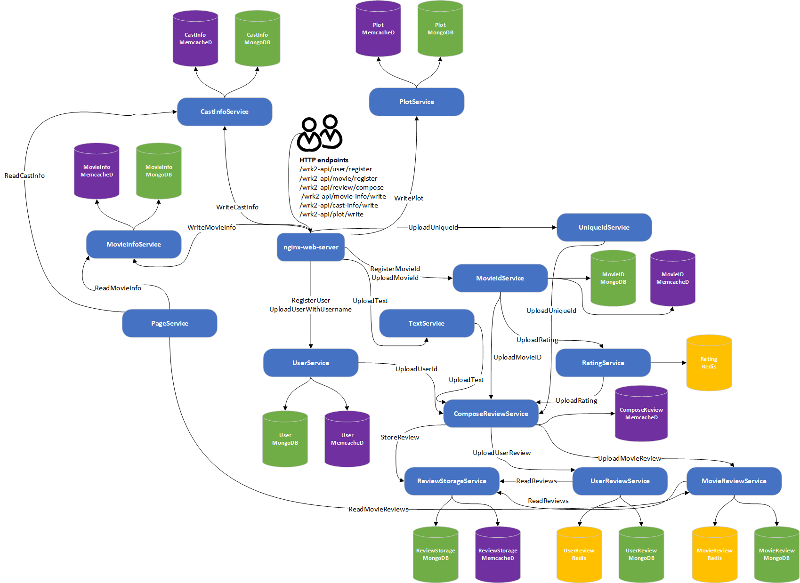

# EXP02 : MediaService

## Workload architecture




The architecture of the MediaService is depicted above. 
We re-implemented this application using our provided interface. 
For simplicity, we only developed the post-review operation. 
In our implementation, this operation involves 12 functions 
and generates 14 intermediate data transfers.
Note that the 'src' directory includes some unused functions.

## Installation

- dependencies
```shell
# lib
sudo apt-get install -y libzstd-dev libssl-dev libz-dev

# mongo-c-driver
sudo apt-get install -y libmongoc-dev libbson-dev libbson-1.0-0

# boost
sudo apt install libboost-all-dev
```

- external storage services: memcached & mongodb

```shell
cd k8s/
kubectl apply -f third-party.yml
```

## Evaluation

For more details, please refer to [here](../bench/intra-node/02_media_service/README.md).

